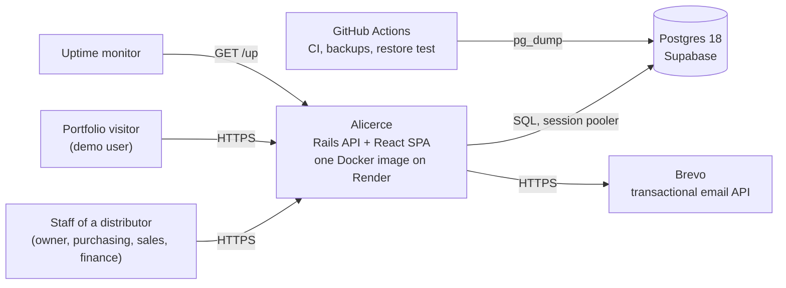
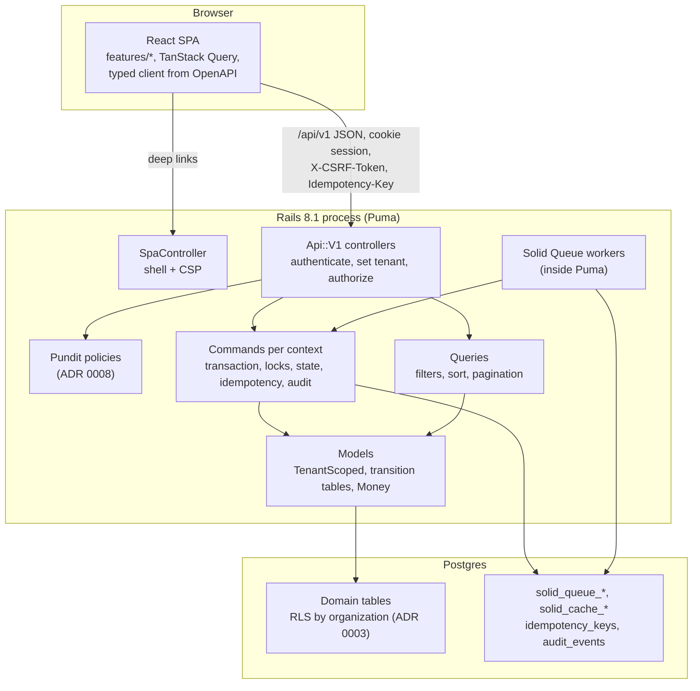
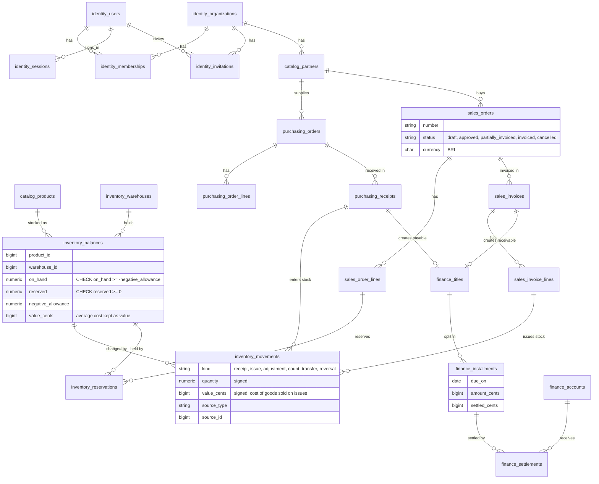
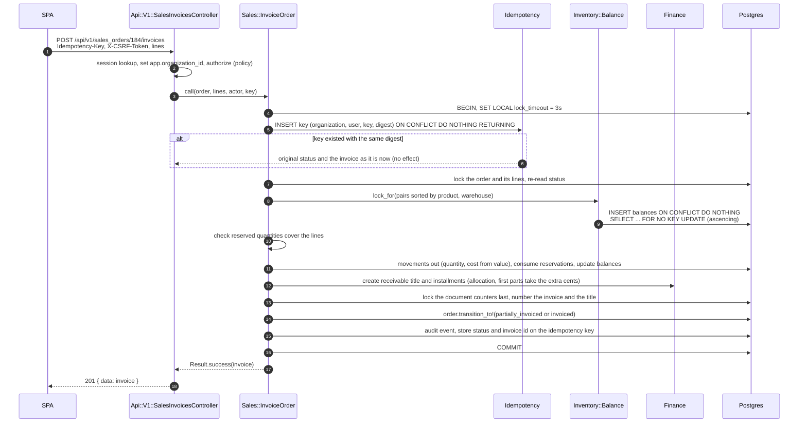

# Architecture

How Alicerce is put together and why. Decisions are recorded in [docs/adr](adr/README.md); the domain rules are in [docs/scope.md](scope.md).

## Context

## Components

Contexts and what they own:

| Context | Owns |
|---|---|
| identity | organizations, users, memberships, invitations, sessions |
| catalog | partners, products, categories, units, unit conversions |
| inventory | warehouses, balances, movements, reservations, negative allowances, counts |
| purchasing | purchase orders, receipts |
| sales | sales orders, invoices |
| finance | titles, installments, settlements, accounts |
| audit | audit events |

Only a context's commands write its tables. Cross-context effects (an invoice creating receivables) happen inside the command of the context that starts them, in one transaction.

## Data model (Milestone 1 core)

Business tables, `audit_events`, `idempotency_keys` and `identity_invitations` carry `organization_id` under row level security; the identity tables used before a tenant is known (users, organizations, memberships, sessions) and the Solid Queue and Solid Cache tables do not (ADR 0003). `organization_id` is omitted below for readability.

## Invoicing a sales order

The flow that proves the loop: invoicing issues stock and creates receivables in one transaction, and a retry with the same key changes nothing.

If any step fails, the transaction rolls back entirely: no invoice without stock issue, no stock issue without receivable, and the idempotency key is gone too, so the retry runs again. A lock timeout or deadlock answers 409 and the SPA retries with the same key (ADR 0004, 0005).

## Request lifecycle

1. TLS ends at the platform edge. Thruster (port 10000, compression, 8 MB cache) forwards to Puma.
2. Host authorization (`APP_HOST`), HSTS, request id. Rails assumes SSL behind the edge.
3. Hashed files under `/spa/assets/` are served as static files with immutable caching. Page navigations (HTML requests to paths without a file extension, outside `/api` and `/spa`) go to `SpaController`, which returns the shell from `frontend/dist` with the CSP header. Anything else answers 404.
4. `/api/v1/*`: session from the `__Host-session` cookie, CSRF check on writes, tenant setting on the connection, the organization's time zone, Pundit authorization, command or query, serializer, JSON envelope.
5. Structured logs with request id, user id and organization id, with personal data filtered.

## Background work

Solid Queue runs as threads inside the Puma process (async mode: one worker thread, a dispatcher and a scheduler) and uses the same database, so a job enqueued in a transaction commits or rolls back with it. Recurring tasks: clearing finished jobs, expiring idempotency keys, the nightly demo reset. External calls (email) always run in jobs, never inside a request transaction. The production image in CI checks that all Solid Queue roles register and that the whole process stays under a 450 MB budget (121 MiB measured).

## Time

Rails runs in `America/Sao_Paulo` (`config.time_zone = "Brasilia"`) and stores timestamps in UTC. Each organization has its own time zone: API requests and jobs run inside `Time.use_zone(organization.time_zone)`, so `Date.current` is the organization's date. Overdue status compares due dates with that date: at 23:30 in Manaus it is already 00:30 in Brasília, and an installment due that day is not yet overdue for a Manaus tenant. Recurring tasks name their zone explicitly in the schedule (`every day at 3am America/Sao_Paulo`), because the container clock is UTC.
